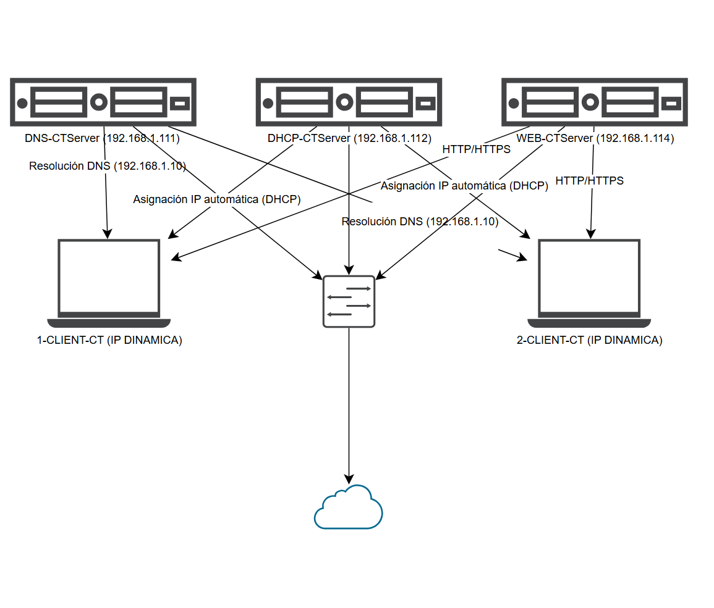

# 🚀 Infraestructura de Servidores Automatizados - Casiopea Technology

[](https://opensource.org/licenses/MIT)
[](https://www.vagrantup.com/)
[](https://www.ubuntu.com/)

Este repositorio presenta una infraestructura de red empresarial completa, diseñada originalmente como proyecto de fin de ciclo de **ASIR** y evolucionada hacia un modelo de **Infraestructura como Código (IaC)**.

## 📊 Descripción General

El proyecto despliega una red de servidores Linux automatizados bajo un entorno virtualizado, garantizando servicios críticos de red, seguridad perimetral y alta disponibilidad.



## 🛠️ Servicios e Infraestructura

| Nodo | Sistema | IP Estática | Servicio |
| :--- | :--- | :--- | :--- |
| **DNS** | Ubuntu | `192.168.1.111` | BIND9 (Resolución interna) |
| **DHCP** | Ubuntu | `192.168.1.112` | ISC-DHCP-Server (Gestión IP) |
| **WEB** | Ubuntu | `192.168.1.114` | Apache2 + Samba (Storage) |
| **Clientes** | Debian | *Dinámica* | Estaciones de trabajo |

## ⚙️ Automatización y IaC

Esta versión del proyecto incluye capacidades avanzadas de automatización:

- **Vagrant Cloud:** Despliegue automatizado de la topología completa (5 máquinas) mediante `Vagrantfile`.
- **Configuración Centralizada:** Uso de `configs/settings.conf` para gestionar IPs y variables globales, permitiendo cambios rápidos en toda la infraestructura.
- **Self-Healing & Backups:** Scripts en Bash para la recuperación automática de servicios y rotación de copias de seguridad.

## 🚀 Cómo desplegar el laboratorio

Si tienes instalado **Vagrant** y **VirtualBox**, puedes levantar la red completa con:

```bash
git clone https://github.com/SharkIT-sys/TFG-Servidores-Automatizados.git
cd TFG-Servidores-Automatizados
vagrant up
```

## 🔐 Seguridad y Auditoría

- **Auditd:** Monitorización en tiempo real de archivos críticos de configuración.
- **Kernel Hardening:** Bloqueo de dispositivos USB y securización de servicios.
- **SSH Management:** Gestión centralizada y segura de nodos.

---
**Proyecto de Fin de Ciclo - Administración de Sistemas Informáticos en Red**
